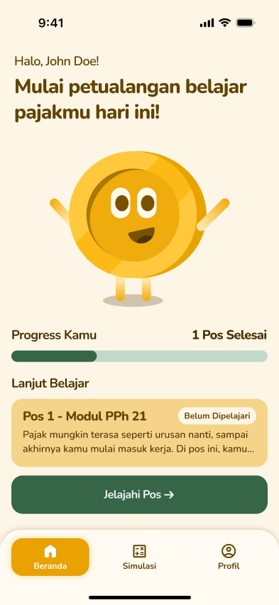

<div align="center">

  

  <p align="center">
    
  </p>

  # Pajarin

  **Aplikasi edukasi pajak interaktif untuk generasi muda Indonesia — belajar PPh 21, PTKP, dan SPT melalui simulasi, kuis, dan panduan visual yang menyenangkan.**

  <br />

  
  
  
  

</div>

---

## Table of contents

- [Project overview](#project-overview)
- [Key features](#key-features)
- [Technology stack](#technology-stack)
- [Project structure](#project-structure)
- [Getting Started](#getting-started)
- [Team](#team)

## Project overview

| Item | Details |
| --- | --- |
| Application Type | Mobile (Cross-platform) |
| Primary Platform | Android & iOS |

Pajarin adalah aplikasi edukasi pajak yang dirancang untuk membantu generasi muda Indonesia memahami kewajiban perpajakan mereka. Banyak karyawan baru, freelancer, dan pelajar tidak memahami bagaimana pajak penghasilan (PPh 21) bekerja, apa itu PTKP, atau cara melaporkan SPT Tahunan. Pajarin mengatasi masalah ini dengan pendekatan belajar interaktif berbasis "pos" pembelajaran, simulasi kalkulator pajak, dan panduan visual menggunakan maskot lucu yang menemani perjalanan belajar pengguna.

## Key features

| Feature | What the user can do |
| --- | --- |
| **Pos Pembelajaran** | Menjelajahi 3 modul edukasi (PPh 21, PTKP, SPT) dengan konten slide interaktif berupa chat, kuis, infografis, dan simulasi slip gaji. |
| **Kuis Interaktif** | Menjawab pertanyaan pilihan ganda dengan feedback langsung — jawaban benar otomatis lanjut, jawaban salah muncul popup untuk coba lagi. |
| **Kalkulator Simulasi Pajak** | Menghitung estimasi PPh 21 dari gaji bruto, status PTKP, dan jumlah tanggungan dengan hasil visual berupa slip gaji. |
| **Pelacakan Progress** | Melihat progres belajar per pos (Belum Dipelajari → Sedang Dipelajari → Sudah Dipelajari) yang tersinkron ke database. |
| **Profil & Edit Data** | Mengelola data profil termasuk nama, pekerjaan, dan range penghasilan dengan pop-up picker. |
| **FAQ Pajak** | Membaca daftar pertanyaan umum seputar pajak dengan tampilan accordion expandable. |
| **CoreTax Checklist** | Memeriksa persiapan aktivasi akun CoreTax DJP dengan checklist interaktif. |
| **Ubah Password** | Mengubah password akun dengan verifikasi password lama melalui Supabase Auth. |

## Technology stack

| Category | Technology | Purpose |
| --- | --- | --- |
| Frontend | Flutter + Dart | Cross-platform mobile UI framework |
| Architecture | Feature-First + MVVM | Struktur folder berbasis fitur dengan ViewModel untuk separation of concerns |
| State Management | Riverpod | Reactive state management untuk auth, progress, dan UI state |
| Navigation | GoRouter | Declarative routing dengan redirect berbasis session |
| Backend | Supabase | Backend-as-a-Service untuk auth, database, dan real-time |
| Database | PostgreSQL (Supabase) | Penyimpanan data user, progress, dan checklist |
| Authentication | Supabase Auth | Email/password login, register, logout, dan update password |
| SVG Rendering | flutter_svg | Rendering file SVG untuk maskot dan logo |
| Responsive UI | flutter_screenutil | Adaptasi ukuran layar untuk berbagai device |
| Local Storage | shared_preferences | Penyimpanan data lokal untuk session caching |

## Project structure

```text
lib/
├── core/
│   ├── constants/       # App-wide constants (Supabase URL, keys, etc.)
│   ├── models/          # Data models (UserModel, PosProgressModel)
│   ├── network/         # HTTP client (Dio)
│   ├── providers/       # Global Riverpod providers (progress_provider)
│   ├── repositories/    # Data repositories (auth, profile, progress)
│   ├── router/          # GoRouter configuration & routes
│   ├── theme/           # Design system (AppColors, AppTypography)
│   └── widgets/         # Reusable UI components
│       ├── app_back_button.dart
│       ├── app_button.dart
│       ├── app_text_field.dart
│       ├── app_radio_option.dart
│       ├── app_status_chip.dart
│       ├── app_progress_bar.dart
│       ├── app_level_bar.dart
│       ├── app_loading_view.dart
│       ├── app_faq_card.dart
│       └── app_checklist_card.dart
├── features/
│   ├── auth/            # Login, Register (views, viewmodels)
│   ├── complete_profile/ # Melengkapi profil setelah register
│   ├── onboarding/      # Intro + 3 step onboarding
│   ├── home/            # Beranda + Jelajahi Pos
│   │   ├── models/      # PosData, PosSlide, mock data per pos
│   │   └── views/       # HomeView, JelajahiPosView
│   ├── pos/             # Detail pos pembelajaran
│   │   ├── viewmodels/  # PosSlideViewModel
│   │   └── views/       # PosDetailView, PosLoadingView
│   │       └── slides/  # Slide widgets (chat, quiz, info, etc.)
│   ├── simulasi/        # Kalkulator & hasil simulasi pajak
│   ├── profile/         # Profil, edit, FAQ, CoreTax, change password
│   └── splash/          # Splash screen
└── main.dart            # Entry point (Supabase init, ProviderScope)
```

## Getting Started

To get a local copy up and running, follow these simple steps.

### Prerequisites

*   Flutter SDK installed on your machine (SDK ^3.11.0).
*   An editor like VS Code or Android Studio.
*   Supabase project (free tier) with URL and Anon Key.

### Installation

1.  **Clone the repo**
    ```sh
    git clone https://github.com/RRaph67/PAJARIN-RAION-HACKJAM-2026
    ```
2.  **Navigate to the project directory**
    ```sh
    cd pajarin
    ```
3.  **Install dependencies**
    ```sh
    flutter pub get
    ```
4.  **Configure Supabase**
    - Open `lib/core/constants/app_constants.dart`
    - Replace `supabaseUrl` and `supabaseAnonKey` with your Supabase project credentials
5.  **Run the app**
    ```sh
    flutter run
    ```

---

## Team

| Name | Role | Responsibilities | Contact |
| --- | --- | --- | --- |
| Rafa | Mobile Engineer | Flutter development, API & backend integration, state management | [GitHub](https://github.com/RRaph67) |
| Valerie | Product Manager | Product roadmap, feature specification, task breakdown & project management | [GitHub](https://github.com/valerieP31) |
| Hassan | UI/UX Designer | Wireframing, UI design system, prototyping, design handoff | [GitHub](https://github.com/nasruharu) |
